# Tutorial 12 Python3 Virtual Environment and Packages
Tentukan direktori unruk meletakkan virtual environment yang akan dibuat, kemudian ketikkan perintah :

.png)

Aktifkan virtual environment(pada windows) :

.png)

Melihat virtual environment dan versi python yang didapatkan, umumnya default dengan sistem yang berjalan atau bisa diatur sesuai dengan kebutuhan :

.png)

Untuk mengatur kebutuhan paket dapat menggunakan pip. Berikut cara untuk menelusuri paket python dengan pip :

.png)

Menginstall paket :

.png)

Install paket dengan spesifik versinya dengan menambahkan == diikuti nomor versi dibelakang nama paketnya :

.png)

Meningkatkan paket ke versi terbaru :

.png)

Menampilkan informasi paket :

.png)

Menampilkan daftar paket yang diinstall :

.png)

Menampilkan daftar paket yang diinstal dengan otuput sesuai format yang diinginkan :

.png)

Requir.txt kemudian dapat dikomit ke kontrol versi dan dikirim sebagai bagian dari aplikasi. Pengguna kemudian dapat menginstal semua paket yang diperlukan dengan menginstal -r:

.png)

# Tutorial memulai Anaconda
1. Install Anaconda
   Buka start menu dam buka Anaconda Prompt

   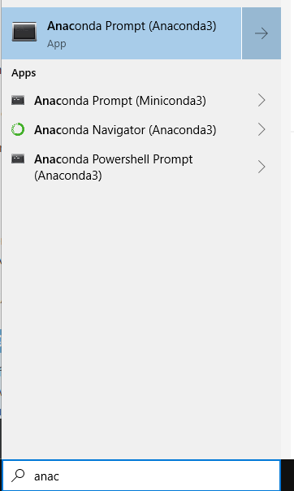
2. Melihat versi conda

    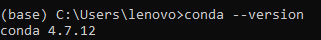

   Update conda ke versi terbaru

    

4. Buat environment snowflakes dan install package biopython

   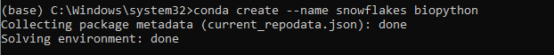
   Aktifkan environment baru dan lihat daftar env :

   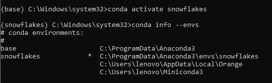

   Ubah environment kembali ke default :

   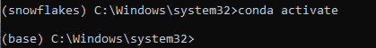

5. Buat env dengan nama snakes dan python versi 3.5 :

   

   Aktifkan env :

   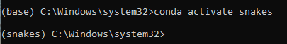

   Pastikan env snakes sudah ditambahkan dan aktif :

   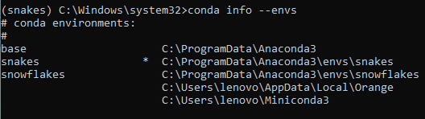

   Melihat versi kesesuain versi python env dengan yang ditentukan dan kembalikan ke env base :

   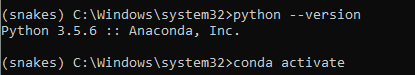

7. Di env snakes dan periksa paket beautifulsoup4 tersedia di repositori Anaconda :

   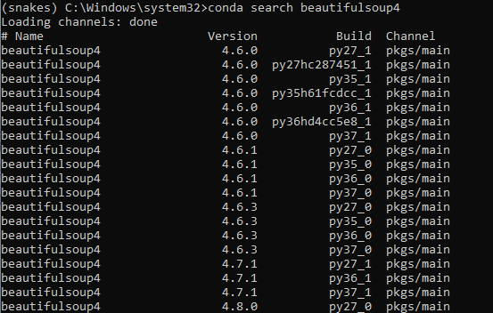

   Install paket beautifulsoup4 :

   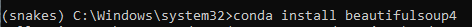

	Periksa daftar paket yang sudah terinstall :

   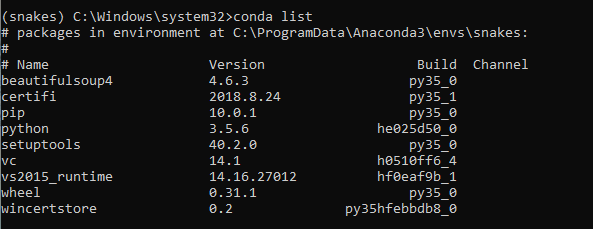