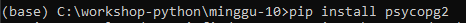
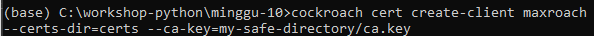
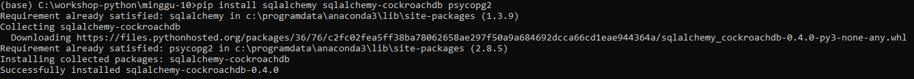

# Build a Python App with CockroachDB and psycopg2
## Step 1. Install the psycopg2 driver

## Step 2. Create the maxroach user and bank database

## Step 3. Generate a certificate for the maxroach user

## Step 4. Run the Python code

Source : https://www.cockroachlabs.com/docs/stable/build-a-python-app-with-cockroachdb.html#step-1-install-the-psycopg2-driver

# Build a Python App with CockroachDB and SQLAlchemy
## Step 1. Install SQLAlchemy

## Step 2. Create the maxroach user and bank database
## Step 3. Generate a certificate for the maxroach user
## Step 4. Run the Python code

Source : https://www.cockroachlabs.com/docs/stable/build-a-python-app-with-cockroachdb-sqlalchemy.html
