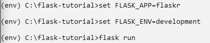
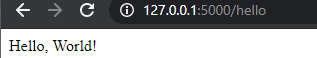
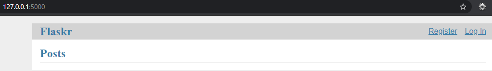
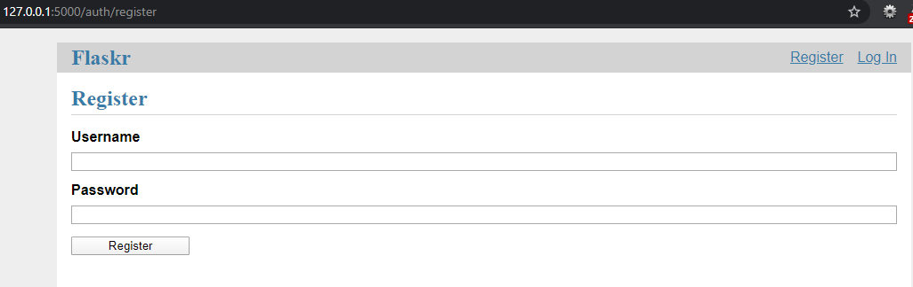
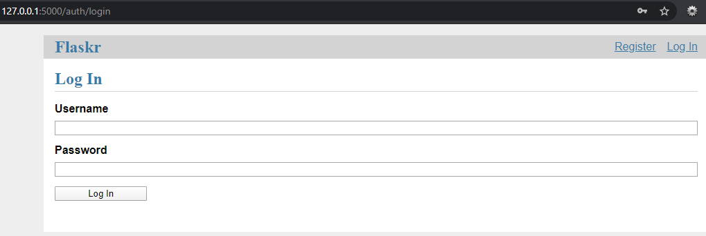
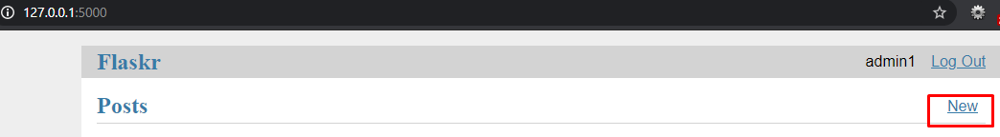
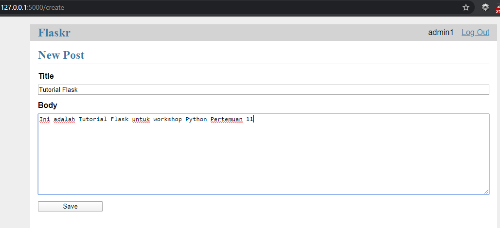
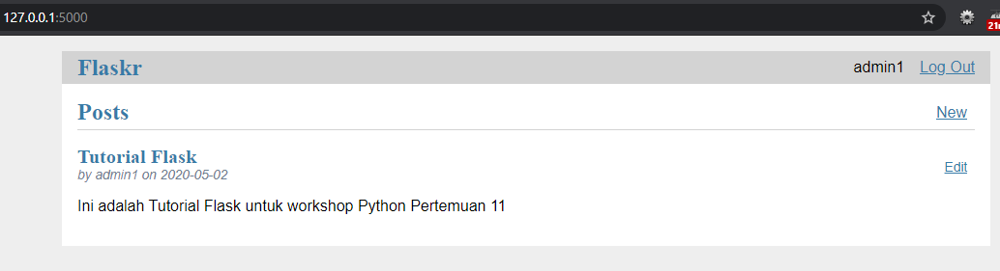

1. Membuat Directory
2. Membuat virtualenv dan install Flask
3. Membuat program sederhana flask dengan satu file
	Cara menjalankan flask :

	

	Hasil :

	

4. Output Tutorial :

	

	Lakukan register untuk dapat masuk ke halaman selanjutnya :

	

	Lakukan login sesuai dengan register :

	

	Pada halaman ini terdapat menu LogOut untuk keluar dan New untuk membuat tulisan, adapula nama user :

	

	Halaman selanjutnya dapat digunakan untuk menuliskan Judul dan Isi yang kemudian dapat di save :

	

	Ketika di save maka hasilnya akan tersimpan dengan Judul, siapa user pembuatnya, tanggal buatnya dan Isi dari tulisan :

	

